# Lab JWT - SSH

**Esteban Barrera Sanabria**

Este laboratorio implementa una API REST de gestión de tareas con autenticación basada en **JWT**, construida con Node.js. Posteriormente como segunda parte cubre el consumo remoto de la API desde un iPhone mediante **SSH** usando Termius.

---

## Archivos del proyecto

```org
lab-jwt/
├── server.js          # Servidor principal (puerto 3000)
├── server-solucion.js # Solución de referencia del profesor (puerto 3001)
├── decodificar.js     # Script para inspeccionar y experimentar con un JWT
README.md
media/            
```

---

## Iniciar el servidor

```bash
node server.js
```

El servidor queda escuchando en `http://localhost:3000`.

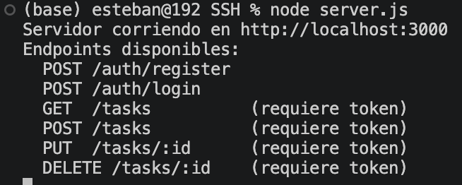

## Registro de usuario

```bash
curl -X POST http://localhost:3000/auth/register \
  -H "Content-Type: application/json" \
  -d '{"username":"ana","email":"ana@test.com","password":"1234"}'
```

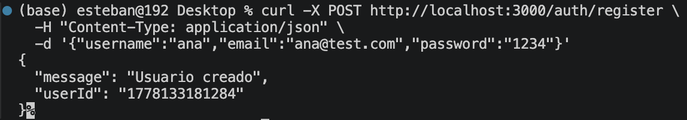

## Login y almacenamiento del token

```bash
TOKEN=$(curl -s -X POST http://localhost:3000/auth/login \
  -H "Content-Type: application/json" \
  -d '{"email":"ana@test.com","password":"1234"}' | python3 -c "import sys,json; print(json.load(sys.stdin)['token'])")

echo $TOKEN
```

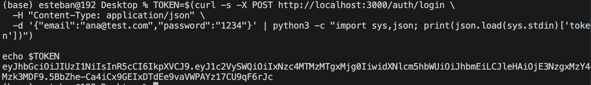

## GET /tasks sin token

```bash
curl http://localhost:3000/tasks
```

Respuesta esperada: `401 Token requerido o invalido`

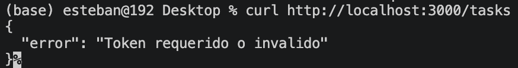

## GET /tasks con token

```bash
curl http://localhost:3000/tasks \
  -H "Authorization: Bearer $TOKEN"
```

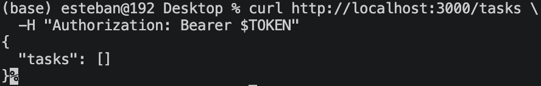

## Crear tarea

```bash
TAREA=$(curl -s -X POST http://localhost:3000/tasks \
  -H "Content-Type: application/json" \
  -H "Authorization: Bearer $TOKEN" \
  -d '{"title":"Tarea de prueba","description":"Para probar PUT y DELETE"}')

echo $TAREA
TAREA_ID=$(echo $TAREA | python3 -c "import sys,json; print(json.load(sys.stdin)['id'])")
echo "ID guardado: $TAREA_ID"
```

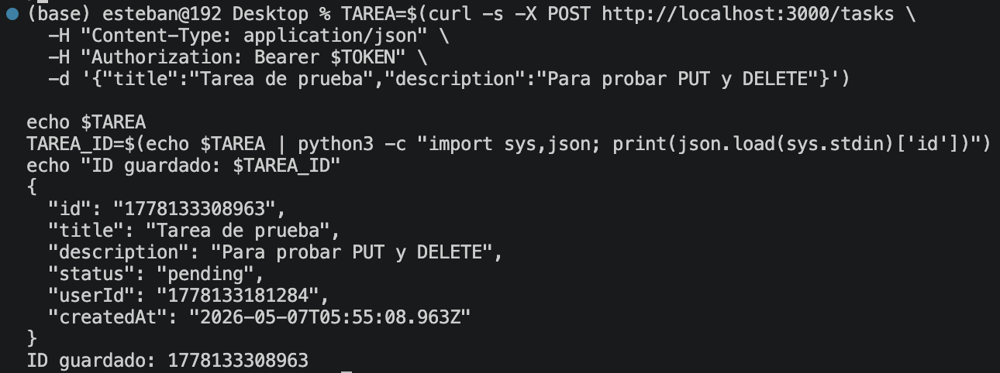

## PUT — Actualizar tarea

```bash
curl -X PUT http://localhost:3000/tasks/$TAREA_ID \
  -H "Content-Type: application/json" \
  -H "Authorization: Bearer $TOKEN" \
  -d '{"status":"completed"}'
```

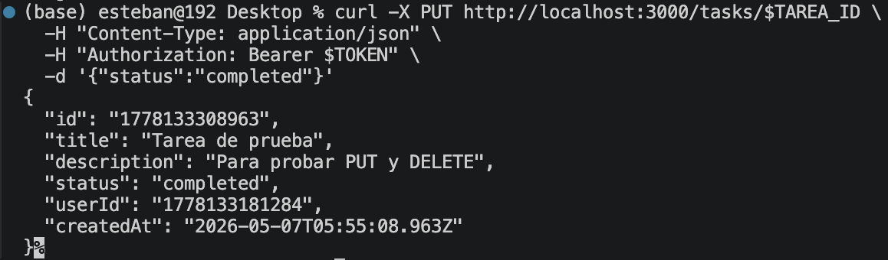

## DELETE — Eliminar tarea

```bash
curl -X DELETE http://localhost:3000/tasks/$TAREA_ID \
  -H "Authorization: Bearer $TOKEN"
```

Respuesta esperada (y obtenida): `204` sin body.

---

## Decodificar el JWT

1. Copiar el token impreso con `echo $TOKEN`
2. Pegarlo en la variable `TOKEN` dentro de `decodificar.js`
3. Ejecutar:

```bash
node decodificar.js
```

El script muestra las tres partes del JWT (header, payload, firma), verifica si está expirado y demuestra que modificar el payload invalida la firma.

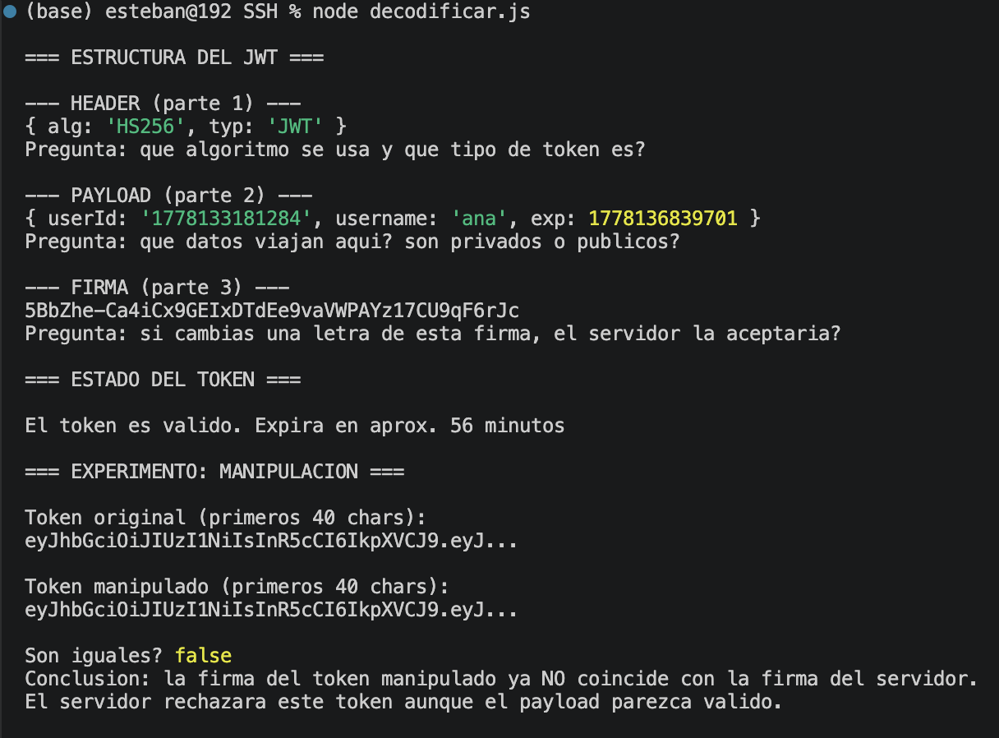

---

## Consumo remoto desde iPhone con Termius

Se consumió la API de forma remota desde un iPhone usando la app *ermius, conectado a la misma red WiFi que el equipo anfitrión (MacBook).

### Obtener la IP local del Mac

```bash
ipconfig getifaddr en0
```

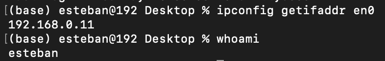

### Desde Termius SIN EL token

```bash
curl http://192.168.0.11:3000/tasks
```

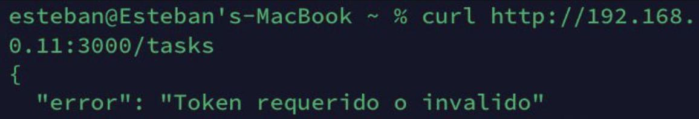

### Desde Termius CON EL token

```bash
curl http://192.168.0.11:3000/tasks \
  -H "Authorization: Bearer TU_TOKEN"
```

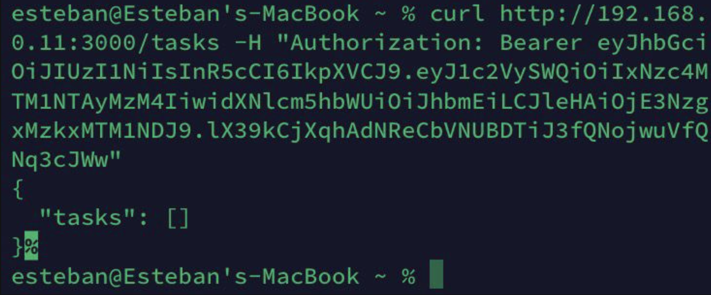

---

## Implementación — PUT y DELETE

El `server.js` implementa ambos endpoints con la siguiente lógica:

**PUT /tasks/:id**

1. Autenticar el token del request
2. Buscar la tarea por ID
3. Retornar `404` si no existe
4. Retornar `403` si el usuario no es el dueño
5. Actualizar los siguientes campos recibidos: `title`, `description` y `status`
6. Retornar la tarea actualizada con `200`

**DELETE /tasks/:id**

1. Autenticar el token del request
2. Buscar la tarea por ID
3. Retornar `404` si no existe
4. Retornar `403` si el usuario no es el dueño
5. Eliminar la tarea con `splice`
6. Retornar `204` sin body

---

## Preguntas del laboratorio

1. **¿Qué información viaja en el Header?**

El algoritmo de firma (`HS256`) y el tipo de token (`JWT`).

2. **¿Los datos del Payload están cifrados?**

No, debido a su codificion unicamente en Base64, es decir, cualquiera puede decodificarlos.

3. **¿Por qué no guardar la contraseña en el payload?**

Por lo mismo del punto anterior, porque Base64 no es cifrado; cualquier persona con el token puede leer su contenido.

4. **¿Qué pasa si alguien roba el token?**

Puede usarlo hasta que expire, pero en este caso se trata de mitigar usando tokens de 60 minutos y HTTPS.

5. **¿Diferencia entre Base64 y AES/RSA?**

Base64 es solo codificación (reversible sin clave). 
AES/RSA son cifrado real (requieren clave secreta para descifrar).

---
